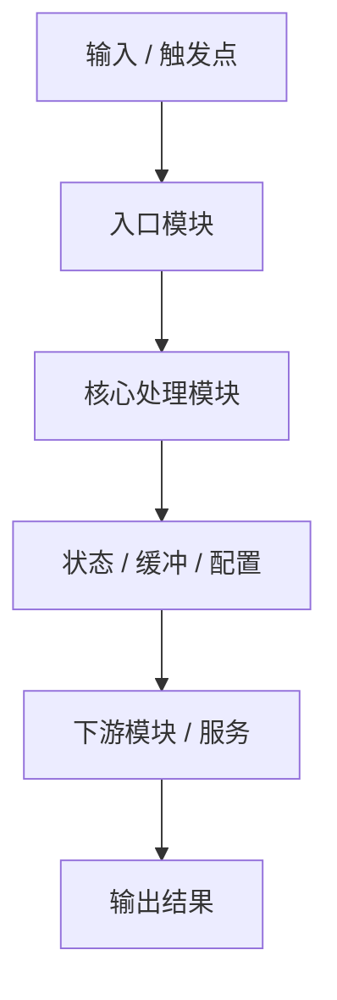
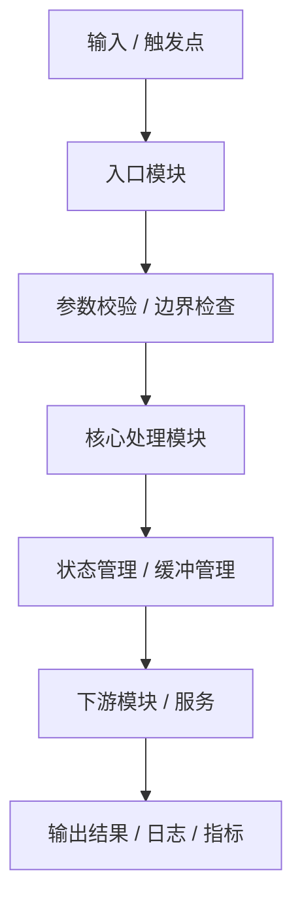
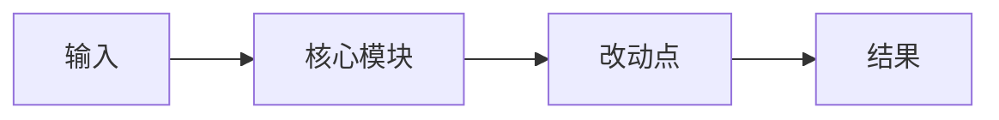

# PLANS.md

本文件定义本仓库中“非简单任务”的标准方案输出格式。

适用场景包括但不限于：

- 技术方案设计
- 功能方案设计
- 模块设计与模块说明
- 代码审查
- 重构方案
- 缺陷定位与修复方案
- 配置迁移
- 性能优化
- 异步 / 分布式 / 推理训练链路分析

Agent 在处理非简单任务时，必须先输出符合本文件要求的方案，再进入实现或修改阶段。

---

## 一、总原则

### 1.1 先方案，后实现

对于以下任务，禁止直接开始修改代码，必须先输出完整方案：

- 涉及多个文件或多个模块
- 涉及架构、接口、配置、状态流转
- 涉及训练 / 推理 / 服务链路
- 涉及异步、并发、锁、队列、缓存、buffer
- 涉及分布式通信、调度、部署
- 涉及重构、迁移、兼容性处理
- 涉及性能优化或疑难问题排查
- 涉及代码审查、质量评估、风险识别

### 1.2 方案不能是纯文字

有效方案不得是大段纯文字描述，必须采用结构化表达。

每份有效方案至少必须包含：

- 明确目标
- 当前理解
- 至少一个图
- 至少一个表
- 实施步骤
- 验证方案
- 风险与回滚
- 审查结论或推荐结论

### 1.3 表述要求

方案必须满足以下要求：

- 表述严谨
- 术语准确
- 结构清晰
- 可评审、可执行、可追踪
- 清楚区分“事实、判断、建议”

禁止：

- 空泛表述
- 无依据下结论
- 大段重复叙述
- 只给结论不给依据
- 只说“可以优化”但不说明优化点、影响范围、验证方式

---

## 二、输出契约

Agent 输出方案时，必须显式区分以下三类内容：

### 2.1 事实（Facts）
来自以下来源的可验证信息：

- 代码
- 配置
- 日志
- 报错栈
- 测试结果
- 现有文档
- 明确的用户需求

### 2.2 判断（Assessment）
基于事实做出的技术判断，例如：

- 问题最可能出在哪个模块
- 当前设计存在什么耦合或风险
- 哪个方案更合理
- 哪类修改更小、更安全

### 2.3 建议（Proposal）
可执行的下一步建议，例如：

- 建议修改哪些文件
- 建议如何拆分模块
- 建议增加哪些校验 / 日志 / 测试
- 建议如何做兼容 / 回滚 / 灰度

---

## 三、图表要求

### 3.1 图的要求

以下场景必须画图：

- 技术方案设计
- 功能流程设计
- 模块关系说明
- 调用链分析
- 训练 / 推理链路说明
- 异步流程
- 分布式流程
- 代码审查中需要说明依赖或状态流转时

优先使用：

1. Mermaid `flowchart`
2. Mermaid `sequenceDiagram`
3. Mermaid `graph TD`
4. Mermaid `classDiagram`
5. ASCII 图（当 Mermaid 不适合时）

图必须“有信息量”，不能只作装饰。

图中应尽量使用真实名称，例如：

- 模块名
- 文件名
- 类名
- 函数名
- 配置项名
- 队列 / 缓冲区 / 锁对象名
- RPC / API 名称

### 3.2 表的要求

以下场景必须使用表格：

- 方案对比
- 模块说明
- 接口说明
- 文件影响分析
- 根因对比
- 验证矩阵
- 风险矩阵
- 兼容性分析
- 代码审查结论

---

## 四、标准方案模板

# 1. 任务目标

用 1~3 句话准确描述本次任务的目标。

### 成功判定

| 项目 | 要求 | 可观测信号 |
|---|---|---|
| 功能目标 | <需要达成什么> | <测试 / 输出 / 日志 / 行为> |
| 边界范围 | <明确不做什么> | <边界说明> |
| 完成标准 | <什么算完成> | <可验证结果> |

---

# 2. 背景与当前理解

说明当前系统、模块或代码片段的背景，以及与本次任务直接相关的上下文。

### 当前理解摘要

- 当前模块承担的职责：
- 当前主要调用入口：
- 当前上下游依赖：
- 当前已知约束：
- 当前已知问题 / 需求：

### 关键事实依据

| 类型 | 来源 | 内容 | 置信度 |
|---|---|---|---|
| 代码 | `path/to/file.py` | <相关模块 / 函数 / 类> | 高 |
| 配置 | `config.yaml` / env / flags | <关键配置项> | 高 |
| 日志 | runtime log / trace | <关键现象> | 高 |
| 文档 | design / readme / 注释 | <已有设计说明> | 中 |
| 推断 | 基于现有信息分析 | <技术判断前提> | 中 |

---

# 3. 需求拆解 / 问题定义

根据任务类型，选择以下一种形式输出。

## 3A. 功能 / 技术方案设计

### 需求拆解表

| 需求项 | 说明 | 优先级 | 约束 / 注意事项 |
|---|---|---|---|
| 功能点 A | ... | P0 | ... |
| 功能点 B | ... | P1 | ... |

### 设计目标

| 目标 | 含义 | 验证方式 |
|---|---|---|
| 可维护性 | ... | ... |
| 可扩展性 | ... | ... |
| 性能 | ... | ... |
| 兼容性 | ... | ... |

## 3B. 代码审查 / 问题分析

### 问题定义

- 当前审查对象：
- 审查重点：
- 预期发现的问题类型：
  - 正确性
  - 鲁棒性
  - 可维护性
  - 可扩展性
  - 性能
  - 并发安全
  - 兼容性
  - 可测试性

### 候选问题 / 根因对比

| 候选项 | 为什么怀疑它 | 反证或不确定点 | 如何验证 | 优先级 |
|---|---|---|---|---|
| 项 A | ... | ... | ... | P1 |
| 项 B | ... | ... | ... | P2 |

---

# 4. 模块与流程说明

本节必须至少包含一个图。

## 4.1 当前结构 / 当前流程图



## 4.2 目标结构 / 建议流程图



## 4.3 图示说明

- 关键入口：
- 核心处理节点：
- 状态持有位置：
- 关键依赖：
- 高风险节点：
- 建议改动落点：

---

# 5. 模块说明

适用于功能设计、模块设计、代码理解、审查说明。

## 5.1 模块职责表

| 模块 / 文件 | 当前职责 | 输入 | 输出 | 主要依赖 | 存在问题 / 关注点 |
|---|---|---|---|---|---|
| `module_a.py` | ... | ... | ... | ... | ... |
| `module_b.py` | ... | ... | ... | ... | ... |

## 5.2 接口说明表

| 接口 / 函数 / 类 | 所在位置 | 作用 | 关键参数 | 返回值 | 注意事项 |
|---|---|---|---|---|---|
| `foo()` | `a.py` | ... | ... | ... | ... |
| `Bar` | `b.py` | ... | ... | ... | ... |

## 5.3 状态 / 配置说明表

| 状态 / 配置项 | 所在位置 | 含义 | 影响范围 | 风险 |
|---|---|---|---|---|
| `buffer_size` | config | ... | ... | ... |
| `timeout` | runtime | ... | ... | ... |

---

# 6. 方案设计 / 审查结论

根据任务类型，选择以下一种形式输出；必要时可两者都写。

## 6A. 方案设计

### 方案候选对比

| 方案 | 核心思路 | 优点 | 缺点 | 适用条件 | 是否推荐 |
|---|---|---|---|---|---|
| 方案 A | ... | ... | ... | ... | 是 |
| 方案 B | ... | ... | ... | ... | 否 |

### 推荐方案

- 推荐采用：
- 推荐理由：
- 相比备选方案的优势：
- 需要注意的实现前提：

## 6B. 代码审查结论

### 审查结论摘要

| 类别 | 结论 | 严重程度 | 建议 |
|---|---|---|---|
| 正确性 | ... | 高 / 中 / 低 | ... |
| 可维护性 | ... | 高 / 中 / 低 | ... |
| 性能 | ... | 高 / 中 / 低 | ... |
| 并发安全 | ... | 高 / 中 / 低 | ... |
| 可测试性 | ... | 高 / 中 / 低 | ... |

### 重点问题清单

| 问题 | 位置 | 影响 | 建议处理方式 | 优先级 |
|---|---|---|---|---|
| ... | `file.py:func` | ... | ... | P0 |
| ... | `module.py` | ... | ... | P1 |

---

# 7. 影响范围分析

## 7.1 文件影响矩阵

| 文件 | 当前作用 | 计划动作 | 风险等级 | 是否必须修改 | 说明 |
|---|---|---|---|---|---|
| `file_a.py` | ... | 修改 / 仅阅读 / 重构 | 低 / 中 / 高 | 是 / 否 | ... |
| `file_b.py` | ... | 修改 / 仅阅读 / 重构 | 低 / 中 / 高 | 是 / 否 | ... |

## 7.2 行为影响分析

| 影响面 | 当前行为 | 目标行为 | 兼容性风险 | 备注 |
|---|---|---|---|---|
| API | ... | ... | 低 / 中 / 高 | ... |
| 配置 | ... | ... | 低 / 中 / 高 | ... |
| 日志 / 指标 | ... | ... | 低 / 中 / 高 | ... |
| 训练 / 推理链路 | ... | ... | 低 / 中 / 高 | ... |

## 7.3 非功能影响

| 维度 | 可能影响 | 说明 |
|---|---|---|
| 性能 | ... | ... |
| 内存 | ... | ... |
| 并发 | ... | ... |
| 可观测性 | ... | ... |
| 可维护性 | ... | ... |

---

# 8. 实施方案

## 8.1 分步实施表

| 步骤 | 动作 | 目标文件 / 模块 | 预期结果 | 风险 |
|---|---|---|---|---|
| 1 | ... | ... | ... | ... |
| 2 | ... | ... | ... | ... |
| 3 | ... | ... | ... | ... |

## 8.2 实施边界

### 本次纳入范围
- ...
- ...

### 本次不纳入范围
- ...
- ...

## 8.3 最小改动原则说明

说明为什么当前方案是“最小可行改动”，以及为什么不扩大范围。

---

# 9. 验证方案

## 9.1 验证矩阵

| 验证项 | 方法 / 命令 | 预期结果 | 失败信号 |
|---|---|---|---|
| 单元测试 | `pytest ...` | ... | ... |
| 冒烟验证 | `python ...` | ... | ... |
| 静态检查 | `ruff check ...` | ... | ... |
| 类型检查 | `mypy ...` / `pyright ...` | ... | ... |
| 运行验证 | 日志 / 指标 / 输出比对 | ... | ... |

## 9.2 额外观测点

- 建议增加的日志：
- 建议增加的断言：
- 建议增加的指标：
- 建议重点关注的状态值：

## 9.3 回归检查

| 回归点 | 不应被破坏的行为 | 检查方式 |
|---|---|---|
| 旧接口行为 | ... | ... |
| 旧配置兼容性 | ... | ... |
| 训练 / 推理主链路 | ... | ... |

---

# 10. 风险与回滚

## 10.1 风险矩阵

| 风险 | 触发条件 | 影响 | 缓解措施 | 回滚方式 |
|---|---|---|---|---|
| ... | ... | ... | ... | ... |

## 10.2 回滚步骤

1. 回滚文件：
   - ...
2. 恢复配置：
   - ...
3. 重新执行验证：
   - ...
4. 确认恢复信号：
   - ...

---

# 11. 最终建议

用 3~6 条简洁结论总结本次方案。

- ...
- ...
- ...
- ...

---

# 12. 实施前摘要

本节用于让实现阶段快速落地，必须简明直接。

## 目标文件
- ...
- ...

## 核心改动
- ...
- ...

## 关键验证命令

```bash
<command 1>
<command 2>
<command 3>
```

## 预期结果
- ...
- ...

---

# 五、简版模板（适用于中小型任务）

对于“范围不大但仍需要方案”的任务，可使用简版模板，但仍不得省略图或表。

## 1. 目标
<一句话说明目标>

## 2. 当前理解

| 项 | 内容 |
|---|---|
| 入口 | ... |
| 核心模块 | ... |
| 风险点 | ... |

## 3. 简图



## 4. 改动计划

| 步骤 | 文件 / 模块 | 动作 |
|---|---|---|
| 1 | ... | ... |
| 2 | ... | ... |

## 5. 验证
- `...`
- `...`

## 6. 风险
- ...
- ...

---

# 六、质量检查清单

在输出最终方案前，必须确认以下事项均满足：

- [ ] 方案不是纯文字堆砌
- [ ] 至少包含一个有效图示
- [ ] 至少包含一个有效表格
- [ ] 目标、边界、完成标准明确
- [ ] 已区分事实、判断、建议
- [ ] 已说明模块职责或影响范围
- [ ] 已给出实施步骤
- [ ] 已给出验证方案
- [ ] 已给出风险与回滚
- [ ] 已给出方案结论或审查结论
- [ ] 内容适合技术评审、代码评审或实施落地