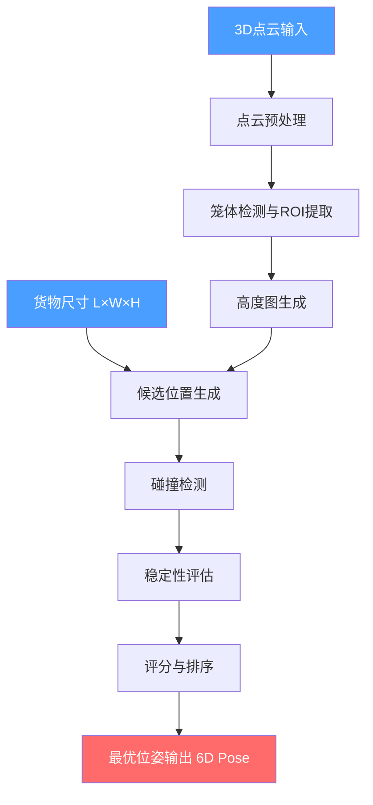

# 基于视觉的3D装箱系统 — 实现方案

## 问题背景

实现一个基于实时3D点云的在线装箱（Online Bin Packing）系统。货物在传送带上逐个到来，系统需要根据货笼当前状态（点云）和当前货物尺寸，计算最优放置位姿。

> [!IMPORTANT]
> 这是一个**在线装箱**问题——货物逐个到来，无法预知后续货物，每次只决策当前货物的放置位置。

### 输入输出
| 项目 | 描述 |
|------|------|
| **输入1** | 货笼实时3D点云（来自深度相机，如RealSense / Kinect） |
| **输入2** | 当前货物的长(L)、宽(W)、高(H) |
| **输出** | 货物中心点在点云坐标系下的6D位姿 `(x, y, z, roll, pitch, yaw)` |

### 约束规则
1. **装箱顺序**：先里后外（+Y优先）、先左后右（+X优先）、先下后上（+Z优先）
2. **支撑规则**：底部必须有足够支撑面，底面不平时（里高外低）不能让货物倾倒出来
3. **来料规则**：货物大小不确定，逐个决策

---

## 系统架构



---

## 核心算法：Heightmap-based Online Packing

### 为什么选择高度图（Heightmap）方案？

| 方案 | 优点 | 缺点 |
|------|------|------|
| **体素（Voxel）** | 精确的3D碰撞检测 | 内存大、计算慢 |
| **高度图（Heightmap）** | 计算高效、天然表达"已装高度" | 无法表示悬空结构 |
| **直接点云** | 最原始最精确 | 计算复杂度极高 |

对于规则货箱的堆叠场景，**高度图**是最合适的表示方式——它将3D问题降维为2.5D，大幅简化计算，同时完全满足装箱需求。

### 算法流程

```
对于每个到来的货物(L, W, H):
  1. 获取当前点云 → 生成高度图 heightmap[rows][cols]
  2. 考虑两种朝向（0°和90°旋转）
  3. 对每种朝向，滑动窗口扫描所有候选放置位置
  4. 对每个候选位置:
     a. 计算放置高度 = 窗口区域内高度图最大值
     b. 碰撞检测：放置后不超出笼体边界和高度限制
     c. 稳定性检测：计算支撑面积比例，检查倾倒风险
     d. 按规则评分（先里后外、先左后右、先下后上）
  5. 选择得分最高的候选 → 输出6D位姿
```

---

## 项目文件结构

```
d:\Code\robot_packing\
├── config.py              # 配置参数（笼体尺寸、分辨率、阈值等）
├── point_cloud_processor.py   # 点云预处理与高度图生成
├── packing_planner.py     # 装箱规划核心算法
├── stability_checker.py   # 稳定性检测模块
├── pose_generator.py      # 6D位姿生成
├── visualizer.py          # 3D可视化（Open3D）
├── main.py                # 主入口 & 演示
├── test_packing.py        # 单元测试
└── requirements.txt       # 依赖
```

---

## 各模块详细设计

### 1. `config.py` — 系统配置

定义全局参数：

```python
# ====== 超参数（可根据实际情况调整） ======

# 货笼物理尺寸（米）
CAGE_LENGTH = 1.0      # Y方向（里-外）
CAGE_WIDTH  = 0.8      # X方向（左-右）
CAGE_HEIGHT = 1.2      # Z方向（高度）

# 高度图分辨率
HEIGHTMAP_RESOLUTION = 0.01  # 1cm per cell

# 货物间隙（米）
PLACEMENT_GAP = 0.01         # 1cm间隙，方便实际放置

# 稳定性阈值
MIN_SUPPORT_RATIO = 0.6      # 底部至少60%面积有支撑
MAX_TILT_ANGLE = 5.0         # 最大允许倾斜角度（度）

# 评分权重（体现先里后外、先左后右、先下后上）
WEIGHT_DEPTH  = 10.0   # Y方向（里优先）权重
WEIGHT_LEFT   = 5.0    # X方向（左优先）权重  
WEIGHT_LOW    = 8.0    # Z方向（低优先）权重
WEIGHT_FIT    = 3.0    # 紧凑度奖励权重
```

---

### 物体坐标系约定

> [!IMPORTANT]
> **初始位姿定义**：货物在传送带上的初始姿态为"自然放置"状态：
> - 物体坐标系原点在货物几何中心
> - 物体X轴 = 长度(L)方向
> - 物体Y轴 = 宽度(W)方向  
> - 物体Z轴 = 高度(H)方向（朝上）
> - 初始位姿：Roll=0, Pitch=0, Yaw=0

**6种放置朝向**（3轴 × 0°/90°组合中的有效独立朝向）：

| 朝向ID | 底面 | 底面尺寸 | 高度 | 旋转描述 |
|--------|------|----------|------|----------|
| 0 | L×W | L × W | H | 原始（自然放置） |
| 1 | W×L | W × L | H | 绕Z轴旋转90° |
| 2 | L×H | L × H | W | 绕X轴旋转90° |
| 3 | H×L | H × L | W | 绕X轴90° + 绕Z轴90° |
| 4 | W×H | W × H | L | 绕Y轴旋转90° |
| 5 | H×W | H × W | L | 绕Y轴90° + 绕Z轴90° |

> 当底面不平时，额外计算贴合底面的微调倾斜角。

---

### 2. `point_cloud_processor.py` — 点云预处理

**核心功能：**
- 加载/接收点云数据
- 去噪（统计离群点移除）
- 笼体ROI裁剪（只保留笼内空间）
- 生成高度图

**高度图生成算法：**
```
输入: 点云 points (N,3), 笼体边界 [x_min, x_max, y_min, y_max]
输出: heightmap (rows, cols)

1. 创建 rows × cols 的零矩阵
2. 对每个点 (x, y, z):
   col = int((x - x_min) / resolution)
   row = int((y - y_min) / resolution)  
   heightmap[row][col] = max(heightmap[row][col], z - z_min)
3. 返回 heightmap
```

> [!NOTE]
> 高度图中每个cell存储的是该位置上最高点的高度值。空cell值为0（即底板高度）。

---

### 3. `packing_planner.py` — 装箱规划核心

**候选位置生成：**
- 将货物尺寸转换为高度图上的格数：`item_cols = ceil(L / resolution)`, `item_rows = ceil(W / resolution)`
- 考虑6种朝向（3轴 × 0°/90°旋转的独立组合）
- 滑动窗口扫描所有合法位置

**评分函数：**
```python
# 支撑面积是准入条件（>= MIN_SUPPORT_RATIO），不参与评分
if support_ratio < MIN_SUPPORT_RATIO:
    continue  # 跳过此候选位置

score = (
    WEIGHT_DEPTH  * (max_row - candidate_row) / max_row  +  # 越里越好（Y大优先）
    WEIGHT_LEFT   * (max_col - candidate_col) / max_col  +  # 越左越好（X小优先）  
    WEIGHT_LOW    * (1.0 - place_height / CAGE_HEIGHT)    +  # 越低越好
    WEIGHT_FIT    * fit_score                               # 与已有货物贴合度
)
```

> [!NOTE]
> 支撑面积作为**准入门槛**而非评分项——只要底部覆盖率 >= `MIN_SUPPORT_RATIO` 即可通过，不追求"越大越好"。

---

### 4. `stability_checker.py` — 稳定性检测

**核心逻辑：**

1. **支撑面积检测**：
   - 计算货物底面区域内，有支撑的cell数量占比
   - 若 `support_ratio < MIN_SUPPORT_RATIO`，拒绝该位置

2. **倾倒风险检测**（重点：底面不平，里高外低）：
   ```
   对候选位置的底面区域:
     1. 计算底面高度的梯度（沿Y方向，里→外）
     2. 若外侧（出口方向）明显低于里侧:
        a. 计算等效倾斜角 θ = arctan(Δh / item_depth)
        b. 判断货物重心是否在支撑多边形内
        c. 若重心投影落在支撑面外 → 有倾倒风险 → 拒绝
     3. 即使不倾倒，若倾斜角 > MAX_TILT_ANGLE 也拒绝
   ```

3. **重心稳定性**：
   - 计算支撑面的凸包（Convex Hull）
   - 检查货物重心的垂直投影是否在凸包内
   - 加安全裕度（重心距边缘的距离 > 阈值）

---

### 5. `pose_generator.py` — 6D位姿生成

将高度图坐标转换回点云坐标系：

```python
# 从候选位置(row, col)和放置高度h 计算6D位姿
x_center = x_min + (col + item_cols/2) * resolution  
y_center = y_min + (row + item_rows/2) * resolution
z_center = z_min + place_height + item_height / 2

# 朝向：由朝向ID确定基础旋转 + 底面倾斜微调
base_roll, base_pitch, base_yaw = ORIENTATION_TABLE[orientation_id]

# 底面倾斜微调：拟合放置区域的平面法向量
if surface_is_uneven:
    tilt_roll, tilt_pitch = fit_surface_tilt(heightmap_region)
else:
    tilt_roll, tilt_pitch = 0.0, 0.0

roll  = base_roll  + tilt_roll
pitch = base_pitch + tilt_pitch  
yaw   = base_yaw

pose_6d = (x_center, y_center, z_center, roll, pitch, yaw)
```

> [!NOTE]
> **底面倾斜微调**：当底面不平但仍满足稳定性要求时，通过最小二乘法拟合放置区域的平面，根据平面法向量计算 `tilt_roll` 和 `tilt_pitch`，使货物贴合底面。

---

### 6. `visualizer.py` — 3D可视化

使用Open3D实现：
- 显示货笼点云
- 高亮显示所有候选位置及其评分（热力图）
- 显示最终选择的放置位置和货物包围盒
- 支持逐步回放装箱过程

---

### 7. `main.py` — 主程序

提供两种运行模式：
1. **模拟演示模式**：使用合成点云数据，模拟多个货物逐个到来的装箱过程
2. **实时模式接口**：可集成到实际系统中，接收实时点云和货物尺寸

---

## 依赖

```
numpy>=1.21.0
open3d>=0.17.0
scipy>=1.7.0
matplotlib>=3.5.0
```

---

## User Review Required

> [!IMPORTANT]
> **货笼尺寸**：从图片看是顺丰快递的标准笼车，我假设了默认尺寸（1.0m × 0.8m × 1.2m），请确认是否正确，或提供实际尺寸。

> [!IMPORTANT]
> **坐标系约定**：
> - Y轴正方向 = 笼车深度方向（里）
> - X轴正方向 = 笼车宽度方向（左/右）
> - Z轴正方向 = 向上
> 
> 这个约定是否与您的相机/点云坐标系一致？

> [!WARNING]
> **实时点云数据**：当前实现将使用合成数据进行演示。如需接入实际相机，需要额外的相机标定和点云采集模块。

## Open Questions

> 已根据用户反馈全部解决，无剩余问题。

---

## Verification Plan

### Automated Tests
- 使用合成点云数据（模拟空笼、半满笼、不平底面等场景）进行自动化测试
- 验证稳定性检测在极端情况下的正确性（如极度倾斜的底面）
- 验证"先里后外、先左后右、先下后上"规则的正确执行

### Visual Verification
- 使用Open3D 3D可视化窗口展示完整的装箱过程
- 逐步显示每个货物的放置结果，验证物理合理性
- 生成高度图的2D热力图，直观展示装箱状态
