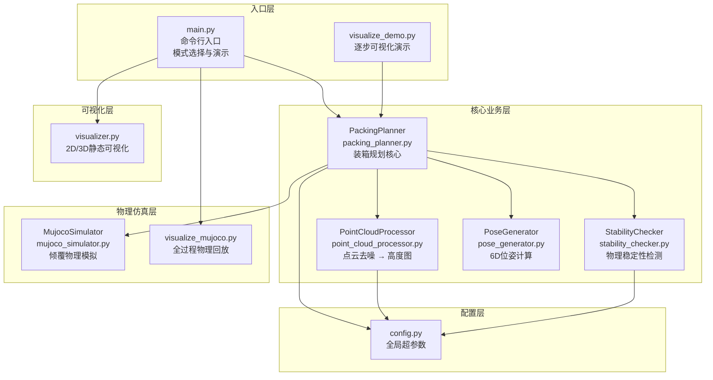
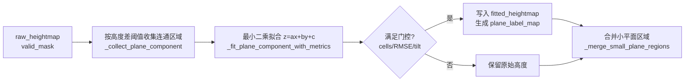
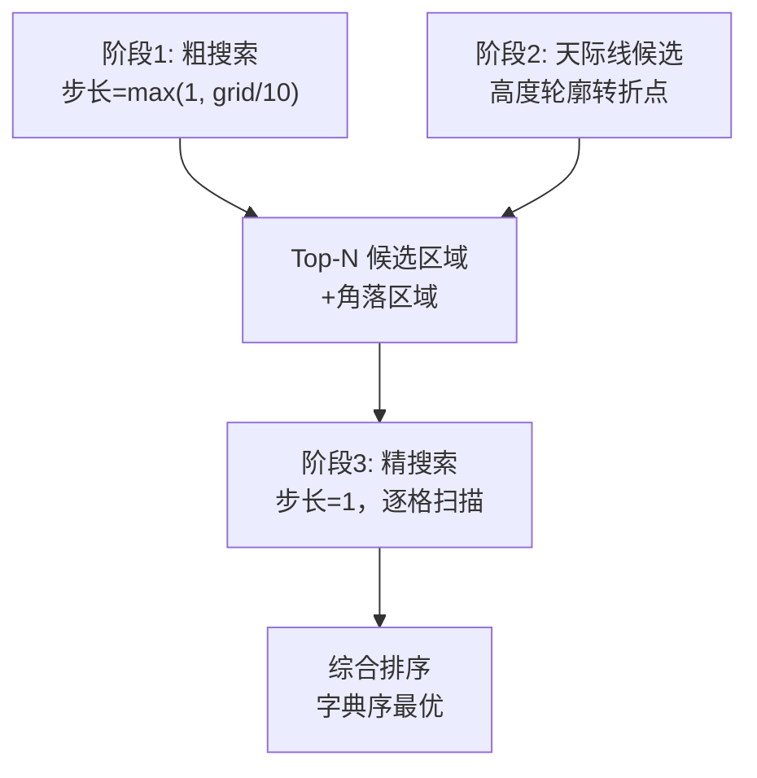
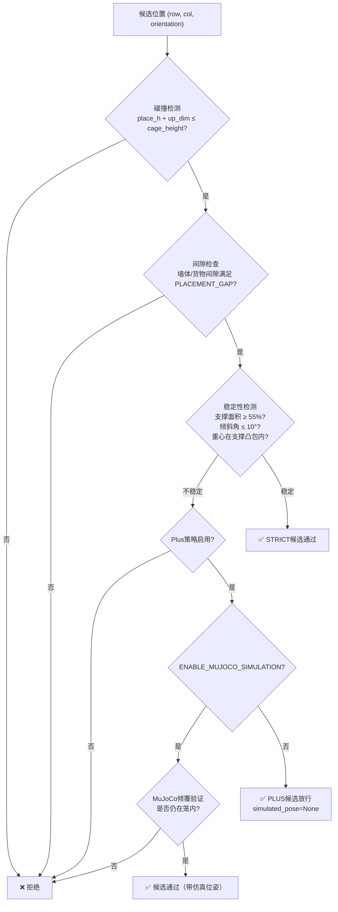
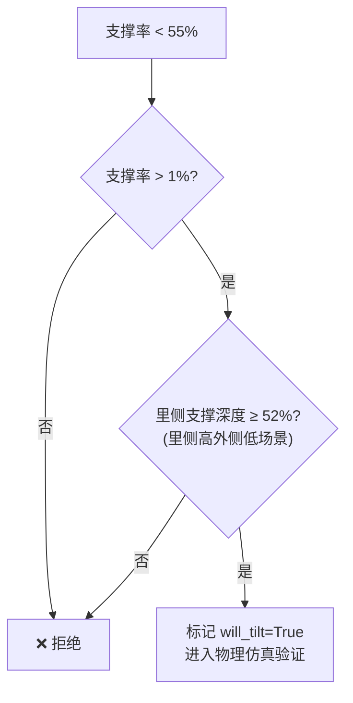
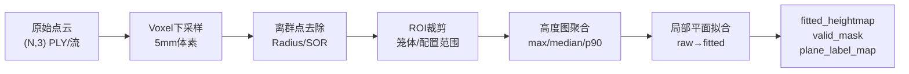
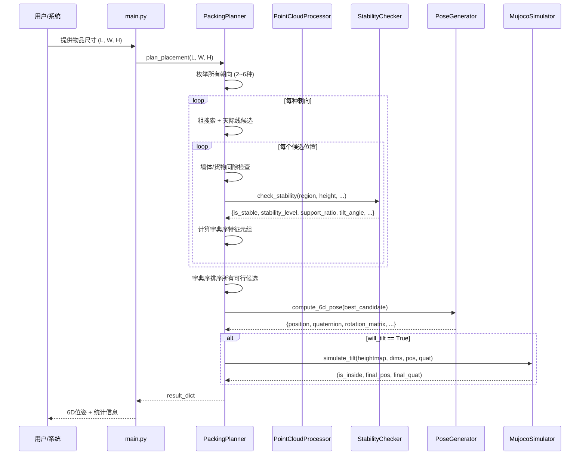

# 基于视觉的3D智能装箱系统 — 详细设计文档

> **版本**: v1.0
> **日期**: 2026-04-25

---

## 目录

1. [项目背景与问题定义](#1-项目背景与问题定义)
2. [系统总体架构](#2-系统总体架构)
3. [坐标系与物理约定](#3-坐标系与物理约定)
4. [核心算法策略](#4-核心算法策略)
5. [模块详细设计](#5-模块详细设计)
6. [数据流与接口规范](#6-数据流与接口规范)
7. [物理仿真引擎](#7-物理仿真引擎)
8. [可视化体系](#8-可视化体系)
9. [配置参数体系](#9-配置参数体系)
10. [测试验证方案](#10-测试验证方案)
11. [依赖与部署](#11-依赖与部署)

---

## 1. 项目背景与问题定义

### 1.1 行业背景

在物流仓储、快递分拣等自动化场景中，大量异形快递包裹需要被高效地装入标准化笼车（roll cage）中。传统方式依赖人工经验进行装箱排列，存在以下核心痛点：

- **效率低下**：装箱速度难以匹配自动化分拣线的吞吐需求
- **空间浪费**：缺乏全局最优视角，装载率长期偏低
- **安全隐患**：堆码不当导致货物倾倒、运输途中散落

### 1.2 核心问题

> **在给定笼车物理约束和实时视觉感知的条件下，为每一个到来的快递包裹自动计算最优的 6D 放置位姿（三维位置 + 三维朝向），使得堆码紧凑、结构稳定。**

具体技术挑战包括：

| 挑战 | 描述 |
|------|------|
| **在线决策** | 物品按随机顺序逐个到来，无法全局重排，必须即时做出不可撤销的放置决策 |
| **不规则初始表面** | 笼车内可能已有部分货物或不平底面，新物品必须在任意高度图表面上稳定放置 |
| **6D 位姿输出** | 需要输出精确到毫米级的三维坐标与旋转矩阵，可直接下发机械臂执行 |
| **物理稳定性** | 必须保证重心投影在支撑面内、底面倾斜可控、不会向笼外倾倒 |
| **视线与轨迹约束** | 遵循"先里后外"放置原则：① 防止外侧物品高于里侧而遮挡机器人头部摄像头视线；② 先放置里侧物品有利于机械臂运动轨迹规划 |

### 1.3 解决方案定位

本系统设计为"**基于高度图的在线启发式 3D 装箱规划器**"，主要特点：


- **输入**：实时 3D 点云（PLY文件或深度相机流） + 待放置物品尺寸 (L, W, H)
- **输出**：6D Pose（位置 xyz + 旋转矩阵/四元数/欧拉角）
- **范式**：在线（Online）、贪心（Greedy）、基于规则（Heuristic）

---

## 2. 系统总体架构

### 2.1 模块拓扑



### 2.2 源文件一览

| 文件 | 类型 | 代码行数 | 职责 |
|------|------|---------|------|
| [config.py] | 配置 | 194 | 全局超参数、朝向表、物理约束 |
| [point_cloud_processor.py] | 核心模块 | 790 | 点云预处理、高度图生成、局部平面拟合、坐标系变换 |
| [packing_planner.py] | 核心模块 | 871 | 装箱规划核心算法、候选搜索、间隙检查、拒绝原因统计 |
| [stability_checker.py] | 核心模块 | 367 | 支撑面积、倾斜角、重心稳定性检测、PLUS 分级 |
| [pose_generator.py] | 核心模块 | 106 | 6D位姿合成与格式化 |
| [mujoco_simulator.py] | 仿真 | 108 | 单物品倾覆物理模拟 |
| [visualize_mujoco.py] | 仿真/可视化 | 196 | 全序列物理回放 |
| [main.py] | 入口 | 448 | 命令行解析与多模式演示、实时接口示例 |
| [visualizer.py] | 可视化 | 298 | 高度图/俯视图/3D静态可视化 |
| [visualize_demo.py] | 可视化 | 555 | Matplotlib逐步3D动画 |
| [test_packing.py] | 测试 | 517 | 单元测试套件 |

---

## 3. 坐标系与物理约定

### 3.1 世界坐标系（装箱坐标系）

系统内部统一使用如下右手坐标系：

```
         Z (向上, 高度)
         |
         |
         |__________ X (向右, 宽度方向)
        /
       /
      Y (向里, 深度方向, 外→里)
```

| 轴 | 物理含义 | 正方向 |
|----|---------|--------|
| **X** | 笼车宽度方向 | 从左到右 |
| **Y** | 笼车深度方向 | 从外（门侧）到里（后侧） |
| **Z** | 笼车高度方向 | 从底到顶 |

> 笼车原点 `cage_origin = (x_min, y_min, z_min)` 位于笼体**左-外-底**角。\
> 高度图中 `row` 对应 Y 方向（外→里），`col` 对应 X 方向（左→右）。

### 3.2 物体坐标系

物体在传送带上的初始姿态（自然放置状态）：

| 物体轴 | 对应尺寸 | 描述 |
|--------|---------|------|
| 物体 X 轴 | 长度 L | 上表面最长边 |
| 物体 Y 轴 | 宽度 W | 上表面次长边 |
| 物体 Z 轴 | 高度 H | 朝上 |

初始姿态为 `Roll=0, Pitch=0, Yaw=0`，物体坐标系原点在其几何中心。

### 3.3 相机坐标系逆变换

当使用真实深度相机（PLY文件）时，原始相机坐标系为 `X=向右, Y=向上, Z=向外`，需通过旋转矩阵转换至装箱坐标系：

```
装箱X = 相机X    # 向右保持不变
装箱Y = -相机Z   # 相机的Z向外 → 装箱的Y向里
装箱Z = 相机Y    # 相机的Y向上 → 装箱的Z向上
```

逆变换由 `PointCloudProcessor.to_camera_absolute_pose()` 实现，用于最终将规划结果转换回机械臂可执行的相机坐标系位姿。

### 3.4 六种放置朝向

对于每个长方体物品 `(L, W, H)`，系统考虑 **6种** 放置朝向（通过旋转使不同面朝下），或在 **XY-only** 模式下仅考虑 **2种**（保持底面朝下，绕Z轴旋转 0°/90°）：

| ID | 底面 X×Y | 高 | 旋转 | 描述 |
|----|---------|---|------|------|
| 0 | L × W | H | (0, 0, 0) | 自然放置 |
| 1 | W × L | H | (0, 0, π/2) | 绕Z轴90° |
| 2 | L × H | W | (π/2, 0, 0) | 绕X轴90° |
| 3 | H × L | W | (π/2, 0, π/2) | 绕X轴90° + 绕Z轴90° |
| 4 | W × H | L | (0, -π/2, 0) | 绕Y轴-90° |
| 5 | H × W | L | (0, -π/2, π/2) | 绕Y轴-90° + 绕Z轴90° |

> 当物品存在等长边时（如 L=W），部分朝向等价，系统自动去重以避免冗余搜索。

---

## 4. 核心算法策略

### 4.1 高度图（Heightmap）表示

系统采用 **2.5D 高度图** 作为核心数据结构，将3D点云投影为2D栅格，每个栅格记录该位置的最大高度值。

```
heightmap[row][col] = 该网格位置上最高点的高度（米，相对笼底）
```

- **分辨率**：默认 1cm/格（`HEIGHTMAP_RESOLUTION = 0.01`）
- **尺寸**：`grid_rows × grid_cols`，由笼体尺寸和分辨率自动计算
- **有效掩码** `valid_mask`：区分"无点（未探测区域）"与"真实零高度（笼底地面）"

#### 4.1.1 聚合策略

同一栅格内有多个3D点时，支持三种聚合模式：

| 模式 | 公式 | 特点 | 适用场景 |
|------|------|------|---------|
| `max` | $h = \max(z_i)$ | 保守估计，高度偏高 | 精度优先 |
| `median` | $h = \text{median}(z_i)$ | 抗噪性最好 | **默认推荐** |
| `p90` | $h = P_{90}(z_i)$ | 介于 max 与 median 之间 | 折中方案 |

#### 4.1.2 空间滤波与局部平面拟合

`PointCloudProcessor` 保留 `_masked_median_filter()` 作为可复用的有效区域中值滤波工具，但当前主链路未直接启用该 3×3 中值滤波；主链路在聚合后执行 `_fit_local_planes_from_heightmap()`，以局部连通平面拟合替代简单滤波。



| 产物 | 来源 | 用途 |
|------|------|------|
| `latest_raw_heightmap` | 点云聚合后的原始高度图 | 调试、对比拟合效果 |
| `latest_fitted_heightmap` | 局部平面拟合后的规划高度图 | `PackingPlanner.heightmap` 的主要输入 |
| `latest_plane_label_map` | 局部平面标签 | 可视化与后续稳定性分析 |

### 4.2 装箱规划算法

#### 4.2.1 总体策略：无调参字典序排序

系统采用**字典序（Lexicographical Order）**排序策略替代传统加权评分，彻底消除人工调参需求：

> 所有可行候选位置产生一个五维元组 `(P0, P1, P2, P3, P4)`，按字典序从小到大排序，最小者即为最优。当前代码实际返回 `(-fit_ratio, z_max, void_volume, -adjacency, corner_dist)`。

| 优先级 | 特征键 | 计算方式 | 优化方向 | 物理含义 |
|--------|--------|---------|---------|---------|
| **P0** | `-fit_ratio` | $-A_{item}/A_{available}$（四方向扩展求最大底面面积） | 越小越好（ratio越大越好） | **空间匹配度**（Best-Fit策略），优先选择底面面积刚好容纳物品的紧凑空间，将大开阔区域留给未来的大物品 |
| **P1** | `z_max` | $h_{place} + h_{up}$ | 越小越好 | 放置后顶面高度，"先低后高" |
| **P2** | `void_volume` | $\sum \max(0, h_{place} - h_{region}) \times r^2$ | 越小越好 | 底部空隙体积，反映表面贴合程度 |
| **P3** | `-adjacency` | 四面贴合度取负 | 越小越好 | 与墙壁/已有物品的贴合程度 |
| **P4** | `corner_dist` | $(Y_{max}-Y_{center})^2 + X_{center}^2$ | 越小越好 | 距里-左角的距离，"先里后外，先左后右" |

P0 的可用底面面积通过从物品占位区向四个方向（左/右/里/外）逐步扩展计算，直到碰到高度超过放置面的障碍物或笼壁。`fit_ratio` 保留 2 位小数做适度分桶，避免微小浮点差异过度压制后续排序维度。

> fit_ratio 基于**底面面积**而非体积。初版曾使用体积（面积 × 笼顶剩余高度），但在真实 PLY 场景中暴露严重缺陷：越靠近笼顶 `available_height` 越小，导致 fit_ratio 被人为抬高，系统优先选择危险的高位置（支撑率低至 1.4%）。改为面积后，高度偏好由 P3 (z_max) 独立控制，两个维度解耦，语义清晰。

> 字典序策略的核心优势：前序特征严格优先于后序特征，不存在权重折中问题，物理意义清晰，无需人工调参。当前实现将 `z_max` 放在 `void_volume` 之前，表示在空间匹配度相同后优先压低堆叠高度，再优化局部贴合质量。

#### 4.2.2 三阶段搜索策略

为在高分辨率高度图（如 80×100 格）上高效搜索最优放置位置，系统采用**粗搜索 → 天际线候选 → 精搜索**三阶段策略：



**阶段1 — 粗搜索**：以 `coarse_step` 为步长遍历所有位置，快速筛选可行候选集。

**阶段2 — 天际线候选生成**（`_extract_skyline_candidates`）：

天际线算法是核心创新之一，基于以下观察：*最优放置位置往往在已有物品的边缘*。天际线候选生成包含四个子策略：

1. **X方向天际线**：逐行扫描高度差 > 5mm 的列位置
2. **Y方向天际线**：逐列扫描高度差 > 5mm 的行位置
3. **已放物品边缘**：每个已放置物品的六个紧贴位置（上下左右+对角）
4. **平坦区域边界**：非零高度区域与零高度区域的交界

**阶段3 — 精搜索**：对 Top-8 粗候选及四个角落区域进行 ±`coarse_step` 范围的逐格精扫。

#### 4.2.3 约束检查体系

每个候选位置需通过以下约束检查：



当前候选拒绝原因由 `last_rejection_stats['rejections']` 记录，覆盖 `orientation_too_large`、`wall_gap`、`item_gap`、`height_limit`、`stability`、`outer_height`、`mujoco_outside` 与 `unknown`。其中 `outer_height` 为保留统计项，当前主链路未触发。

#### 4.2.4 外侧高度约束

外侧高度约束服务于两个实际工程需求：**(1)** 如果外侧物品高于里侧，会遮挡安装在机器人头部的深度摄像头的视线，导致无法感知里侧空间状态；**(2)** 放置里侧物品时机械臂需通过外侧空间，外侧过高会增大轨迹规划难度。因此系统实施外侧高度约束：

- 在每一列 X 方向上，新放置物品的顶面高度不得显著超过**该列里侧**所有物品的最大高度
- 违规容差：默认 10cm（`OUTER_HEIGHT_TOLERANCE`）
- 违规比率阈值：默认 2/3（`OUTER_HEIGHT_CHECK_RATIO`），即超过 67% 的列违规时拒绝

> 当前代码状态：`PackingPlanner._check_outer_height_constraint()` 和 `_get_adaptive_constraints()` 均已实现，但 `_evaluate_position()` 中对外侧高度约束的调用处于注释状态。因此本约束属于**保留能力/可重新启用设计**，不是当前候选评估主链路的强制过滤条件。当前“先里后外”主要由字典序中的 `corner_dist` 体现。

#### 4.2.5 自适应约束松弛

随着填充率增加，系统可动态放宽**外侧高度约束**（但支撑面积约束始终严格）。该机制当前随外侧高度约束一并处于保留状态：

```python
# fill_ratio > 0.7 时开始松弛
if fill > 0.7:
    progress = (fill - 0.7) / 0.3       # 0 → 1
    tol  = 0.10 + progress * 0.03       # 10cm → 13cm
    ratio = 0.67 + progress * 0.13      # 0.67 → 0.80 (上限 0.85)
```

> 支撑面积比（`MIN_SUPPORT_RATIO = 0.55`）**永不通过自适应逻辑松弛**。若 `TRY_PLUS_PACKING=True`，低于严格阈值的候选会进入 PLUS 分级，并需满足额外支撑深度或物理验证条件。

### 4.3 稳定性检测算法

#### 4.3.1 支撑面积比

```python
support_mask = (place_height - region) <= SUPPORT_HEIGHT_TOLERANCE  # 2cm容差
support_ratio = count(support_mask == True) / total_cells
```

地面放置（`place_height ≈ 0`）时，全部视为有支撑。

#### 4.3.2 底面倾斜角拟合

使用最小二乘法拟合支撑区域的平面方程 $z = ax + by + c$：

$$\text{tilt\_angle} = \arccos\left(\frac{1}{\sqrt{a^2 + b^2 + 1}}\right)$$

分量分解：
- `tilt_roll = arctan2(b, 1)` — 绕X轴的倾斜
- `tilt_pitch = arctan2(-a, 1)` — 绕Y轴的倾斜

> 平面拟合仅使用 `support_mask` 内（容差范围内）的点，排除悬空部分对拟合结果的干扰。这一设计使得物品可在阶梯型表面边缘稳定放置。

#### 4.3.3 重心投影稳定性

1. **构建支撑凸包**：将所有支撑点的2D坐标构建凸包（`scipy.spatial.ConvexHull`）
2. **重心投影**：物体重心（底面几何中心）向下投影到支撑面
3. **包含性检测**：使用射线交叉法判断重心是否在凸包内
4. **安全裕度**：重心距凸包边缘至少 1cm 或底面短边的 5%

特别关注"**里高外低**"场景（Y方向梯度为负），此时重心向外偏移，倾倒风险最高。

#### 4.3.4 Plus装箱策略

当支撑面积不足但满足特定条件时，启用物理仿真验证而非直接拒绝：



### 4.4 6D位姿计算

#### 4.4.1 位置计算

```python
x_center = cage_origin[0] + (col + item_cols / 2.0) * resolution
y_center = cage_origin[1] + (row + item_rows / 2.0) * resolution
z_center = cage_origin[2] + place_height + up_dim / 2.0
```

#### 4.4.2 旋转合成

```python
final_roll  = base_roll  + tilt_roll   # 基础朝向 + 底面倾斜微调
final_pitch = base_pitch + tilt_pitch
final_yaw   = base_yaw                 # Yaw 不受倾斜影响
```

旋转顺序采用 **ZYX 外旋**（等价于 `scipy.Rotation.from_euler('ZYX', [yaw, pitch, roll])`）。

#### 4.4.3 输出格式

| 字段 | 类型 | 描述 |
|------|------|------|
| `position` | `(x, y, z)` | 物体中心的世界坐标 |
| `orientation_euler` | `(roll, pitch, yaw)` | 欧拉角（弧度）|
| `rotation_matrix` | `ndarray (3,3)` | SO(3) 旋转矩阵 |
| `quaternion` | `(x, y, z, w)` | 单位四元数（scipy格式）|

---

## 5. 模块详细设计

### 5.1 点云预处理器 — `PointCloudProcessor`



**关键设计决策**：

1. **Voxel下采样**（默认 5mm）：使点密度均匀化，降低后续处理计算量约4-8倍
2. **Radius离群点去除**（默认 2cm半径、6邻居）：对"局部高值但非全局离群"的深度相机飞点效果优于SOR
3. **双轨裁剪**：仿真模式按笼体物理边界裁剪；真实点云按配置文件裁剪参数裁剪
4. **真实点云动态尺度**：真实 PLY 模式按 `PLY_CROP_*` 重新锁定局部装箱原点、宽深高和网格尺寸，并通过 `real_scale` 兼容毫米/米级点云
5. **局部平面拟合**：当前主链路缓存 `latest_raw_heightmap`、`latest_fitted_heightmap` 和 `latest_plane_label_map`，规划器使用拟合后的高度图降低深度噪声影响

### 5.2 装箱规划器 — `PackingPlanner`

**核心职责**：维护高度图状态，对每个新物品搜索最优放置方案。

**内部状态**：
- `heightmap`：当前高度图 `(grid_rows, grid_cols)`
- `raw_heightmap`：点云聚合后的原始高度图，用于调试和可视化对比
- `valid_mask`：有效数据掩码
- `plane_label_map`：局部平面标签图
- `placed_items`：已放置物品列表（含完整位姿信息）
- `last_rejection_stats`：最近一次规划的候选评估与拒绝原因统计

**关键方法**：

| 方法 | 功能 |
|------|------|
| `plan_placement(L, W, H)` | 为给定尺寸物品计算最优放置方案 |
| `update_heightmap_from_ply(path)` | 从PLY文件更新高度图 |
| `update_heightmap_from_pointcloud(pts)` | 从实时点云更新高度图 |
| `update_heightmap_with_placement(...)` | 模拟模式下标记新放置物品到高度图 |
| `get_last_rejection_stats()` | 获取最近一次候选搜索失败/过滤原因统计 |
| `get_packing_stats()` | 获取当前装箱统计（利用率、高度等）|

### 5.3 稳定性检测器 — `StabilityChecker`

**三重检测路径**：

```
check_stability()
├── 支撑面积比检测 → STRICT: support_ratio ≥ 55%
├── PLUS分级 → support_ratio > 1% 且满足额外支撑深度条件
├── 底面倾斜角检测 → tilt_angle ≤ 10°
│   └── _fit_surface_tilt() — 最小二乘平面拟合
└── 重心投影稳定性检测
    ├── _check_center_of_gravity() — 凸包包含性
    ├── _point_in_convex_hull() — 射线交叉法
    ├── _point_to_hull_distance() — 安全裕度
    └── _compute_y_gradient() — 里外倾斜方向
```

### 5.4 位姿生成器 — `pose_generator`

纯函数模块，无状态，提供：

- `compute_6d_pose(...)` — 从栅格坐标+朝向+倾斜参数合成6D位姿
- `pose_to_transform_matrix(pose)` — 转4×4齐次变换矩阵
- `format_pose_string(pose)` — 人类可读的位姿字符串

---

## 6. 数据流与接口规范

### 6.1 单物品装箱数据流



### 6.2 关键数据结构

#### 放置结果 `result` 字典

```python
{
    'pose': {
        'position': (x, y, z),            # 物体中心坐标
        'orientation_euler': (r, p, y),    # 欧拉角（弧度）
        'rotation_matrix': ndarray(3,3),   # 旋转矩阵
        'quaternion': (qx, qy, qz, qw),   # 四元数
    },
    'sort_key': (-fit_ratio, z_max, void_vol, -adj, corner_dist),  # 排序特征（5元组）
    'orientation': {                       # 朝向信息
        'base_dims': (bx, by),
        'up_dim': float,
        'roll': float, 'pitch': float, 'yaw': float,
        'desc': str,
    },
    'grid_pos': (row, col),               # 高度图网格位置
    'place_height': float,                 # 放置底面高度
    'item_grid_size': (rows, cols),        # 物品占据的网格数
    'stability': {                         # 稳定性信息
        'is_stable': bool,
        'support_ratio': float,
        'tilt_angle': float,
        'tilt_roll': float,
        'tilt_pitch': float,
        'will_tilt': bool,
        'stability_level': 'STRICT' | 'PLUS' | 'INVALID',
    },
    'simulated_pose': {...} | None,        # Plus策略仿真后位姿
}
```

#### 已放置物品 `placed_items` 列表元素

```python
{
    'dimensions': (L, W, H),    # 物品原始尺寸
    'result': result_dict,       # 完整放置结果
}
```

---

## 7. 物理仿真引擎

### 7.1 单物品倾覆仿真 — `MujocoSimulator`

**用途**：当 Plus 装箱策略检测到物品可能倾覆时，使用 MuJoCo 物理引擎进行真实物理模拟。

**仿真流程**：

1. 将当前高度图局部区域（物品中心 ±0.4m）转换为静态碰撞箱体阵列
2. 在计划放置位置创建带 freejoint 的待放置物品
3. 设置重力 (0, 0, -9.81)，时间步长 0.005s
4. 运行最多 1000 步（5秒物理时间），直至线速度和角速度均 < 1e-3
5. 读取最终位姿 `(final_pos, final_quat)`
6. 边界检查：物品是否仍在笼体范围内（±0.1m容差）

**判定结果**：
- ✅ 物品倾覆后仍留在笼内 → 使用仿真后位姿更新结果
- ❌ 物品滑出笼外 → 拒绝该候选，尝试下一个

### 7.2 全序列物理回放 — `visualize_mujoco.py`

**用途**：在装箱规划完成后，使用 MuJoCo 交互式查看器按顺序回放所有物品的下落堆叠过程。

**技术要点**：

- 所有物品初始置于远离笼体的"待命区"（x=50m处）
- 逐个将物品传送至规划位姿上方 0.5cm 处，释放并等待物理沉降
- 每个物品模拟 1.5 秒下落 + 0.5 秒缓冲
- 全部投放后挂起窗口，允许用户自由旋转视角观察
- 支持初始高度图注入（来自PLY点云的既有笼内物品）

---

## 8. 可视化体系

系统提供四层可视化能力：

### 8.1 2D 高度图热力图

- **实现**：Matplotlib `imshow` + `YlOrRd` colormap
- **用途**：俯瞰笼内高度分布
- **模块**：`visualizer.visualize_heightmap()`

### 8.2 2D 俯视图 + 物品轮廓

- **实现**：在灰度高度图上叠加彩色矩形轮廓
- **用途**：检查物品平面排列布局
- **模块**：`visualizer.visualize_packing_2d()`

### 8.3 3D 静态可视化

- **实现**：Open3D `TriangleMesh` + `LineSet`
- **内容**：笼车线框 + 彩色长方体 + 可选原始点云背景
- **交互**：自由旋转/缩放/平移
- **模块**：`visualizer.visualize_packing_3d()`

### 8.4 逐步过程可视化

- **实现**：Matplotlib 3D + 信息面板 + 高度图联动
- **内容**：每步一张三联图（3D视图 + 高度图 + 文字面板），外加总览拼图
- **输出**：PNG 图片保存至 `output/` 目录
- **模块**：`visualize_demo.py`

### 8.5 MuJoCo 物理动态可视化

- **实现**：`mujoco.viewer` 交互式3D窗口
- **内容**：真实物理引擎驱动的下落/碰撞/堆叠全过程
- **交互**：实时旋转视角，观察重力沉降和碰撞效果
- **模块**：`visualize_mujoco.py`

---

## 9. 配置参数体系

所有超参数集中于 [config.py]，分为以下组：

### 9.1 笼体物理参数

| 参数 | 默认值 | 单位 | 描述 |
|------|--------|------|------|
| `CAGE_WIDTH` | 0.8 | m | X方向宽度 |
| `CAGE_LENGTH` | 1.0 | m | Y方向深度 |
| `CAGE_HEIGHT` | 1.2 | m | Z方向高度 |
| `HEIGHTMAP_RESOLUTION` | 0.01 | m | 高度图分辨率（1cm）|
| `PLACEMENT_GAP` | 0.02 | m | 物品/墙体间隙（2cm）；当前前侧开口不强制前向间隙 |

### 9.2 稳定性阈值

| 参数 | 默认值 | 描述 |
|------|--------|------|
| `MIN_SUPPORT_RATIO` | 0.55 | STRICT 候选底部最低支撑面积比 |
| `MAX_TILT_ANGLE` | 10.0° | 最大允许倾斜角 |
| `SUPPORT_HEIGHT_TOLERANCE` | 0.02m | 支撑高度容差（2cm内视为同一平面）|

### 9.3 约束参数

| 参数 | 默认值 | 描述 |
|------|--------|------|
| `OUTER_HEIGHT_TOLERANCE` | 0.10m | 外侧物品高于里侧的容差 |
| `OUTER_HEIGHT_CHECK_RATIO` | 0.67 | 违规列比率阈值 |
| `TRY_PLUS_PACKING` | True | 是否启用Plus策略（物理仿真验证倾覆）|
| `MIN_SUPPORT_LENGTH_RATIO_Y` | 0.52 | Plus策略下里侧支撑深度比最小值 |
| `ENABLE_MUJOCO_SIMULATION` | False | PLUS 候选是否即时调用 MuJoCo 做倾覆验证；False 时直接保留规划位姿 |

### 9.4 点云预处理参数

| 参数 | 默认值 | 描述 |
|------|--------|------|
| `VOXEL_DOWNSAMPLE_SIZE` | 0.005m | 体素下采样尺寸 |
| `OUTLIER_METHOD` | `'radius'` | 离群点去除方法 |
| `RADIUS_OUTLIER_RADIUS` | 0.02m | 半径搜索范围 |
| `RADIUS_OUTLIER_MIN_NEIGHBORS` | 6 | 半径内最少邻居数 |
| `HEIGHTMAP_AGGREGATION` | `'median'` | 高度图聚合策略 |
| `PLANE_HEIGHT_DIFF_THRESHOLD` | 0.02m | 局部平面连通区域高度差阈值 |
| `PLANE_SMALL_REGION_MAX_CELLS` | 30 | 小平面区域并入邻近平面的最大单元数 |
| `PLANE_FIT_REPLACE_MAX_TILT_DEG` | 8.0° | 低倾角平面全量替换拟合值的最大倾角 |
| `PLANE_FIT_MAX_RMSE` | 0.02m | 平面拟合最大 RMSE |
| `PLANE_FIT_MIN_CELLS` | 8 | 允许拟合的最小单元数 |
| `PLANE_FIT_SLOPE_BLEND_ALPHA` | 0.35 | 高倾角弱拟合时拟合值混合权重 |

### 9.5 PLY 裁剪参数

| 参数 | 默认值 | 描述 |
|------|--------|------|
| `PLY_CROP_X` | (-0.88, -0.05) | X方向裁剪范围 |
| `PLY_CROP_Y` | (0.0, 0.45) | Y方向裁剪范围 |
| `PLY_CROP_Z` | (-1.1, -0.20) | Z方向裁剪范围 |

---

## 10. 测试验证方案

### 10.1 单元测试体系

测试文件 [test_packing.py] 的 `run_all_tests()` 当前包含 14 个测试用例：

| # | 测试名称 | 测试范围 | 验证目标 |
|---|---------|---------|---------|
| 1 | `test_orientations` | `config.get_orientations` | 6种朝向生成正确性；等长边去重 |
| 2 | `test_orientations_xy_only` | `config.get_orientations(xy_only=True)` | XY-only模式仅生成2种底面朝下朝向 |
| 3 | `test_heightmap_generation` | `PointCloudProcessor.generate_heightmap` | 空点云、平面点云、valid_mask、三种聚合模式对比 |
| 4 | `test_local_plane_fitting_on_heightmap` | `PointCloudProcessor._fit_local_planes_from_heightmap` | 连续斜平面拟合后 RMSE 降低 |
| 5 | `test_plane_label_map_splits_step_surface` | 局部平面标签 | 明显台阶被拆成至少两个局部平面 |
| 6 | `test_small_plane_region_is_merged` | 小平面区域合并 | 孤立小区域并回周围主平面 |
| 7 | `test_planner_updates_with_fitted_heightmap` | `PackingPlanner.update_heightmap_from_pointcloud` | 规划器同步 raw/fitted/label 三类高度图产物 |
| 8 | `test_stability_checker` | `StabilityChecker.check_stability` | 平坦底面/完全支撑/稀疏支撑/严重倾斜四种场景 |
| 9 | `test_pose_generation` | `compute_6d_pose` | 位置计算精度、四元数单位化、变换矩阵正确性 |
| 10 | `test_packing_planner_empty_cage` | `PackingPlanner.plan_placement` | 空笼首物放置于里-左-底 |
| 11 | `test_packing_xy_only` | `PackingPlanner(xy_only=True)` | XY-only模式下 roll/pitch 始终为0 |
| 12 | `test_outer_height_constraint` | `PackingPlanner._check_outer_height_constraint` | 外侧高度约束函数行为验证；当前主链路调用被注释 |
| 13 | `test_packing_sequence` | 连续4件装箱 | 多物品连续放置、统计信息正确 |
| 14 | `test_oversized_item` | 超大物品 (2m³) | 超出笼体的物品返回 None |

**运行方式**：

```bash
python test_packing.py
```

### 10.2 集成演示测试

| 命令 | 测试场景 | 验证内容 |
|------|---------|---------|
| `python main.py` | 12件合成物品模拟装箱 | 端到端流程、可视化正确性 |
| `python main.py --xy-only` | XY-only模式 | 朝向约束有效性 |
| `python main.py --uneven` | 不平底面场景 | 底层不平时上层放置稳定性 |
| `python main.py --ply data/xxx.ply` | 真实PLY点云 | 点云处理管线、坐标变换 |
| `python main.py --ply xxx.ply --xy-only --visualize-mujoco` | PLY + MuJoCo | 全链路集成 |
| `python visualize_demo.py` | 逐步可视化 | 12步图片生成正确性 |

### 10.3 验证指标

| 指标 | 计算方式 | 期望范围 |
|------|---------|---------|
| **放置成功率** | 成功放置数 / 总物品数 | ≥ 90% |
| **体积利用率** | Σ(V_item) / V_cage | 20%-40%（取决于场景）|
| **最大高度** | max(heightmap) | ≤ CAGE_HEIGHT |
| **稳定性通过率** | STRICT 候选支撑率 ≥ 55%；PLUS 候选满足额外支撑深度/仿真条件 | 100% |

### 10.4 真实场景验证

1. **PLY点云输入**：使用实际深度相机采集的 `fused_service_trigger.ply` 文件验证
2. **坐标系逆变换验证**：检查外部物理系统位姿输出是否匹配实际相机坐标系
3. **8件真实包裹**：使用 AprilTag 标定的8种真实包裹尺寸进行装箱测试
4. **MuJoCo物理验证**：在仿真环境中回放全部装箱序列，确认物理可行性

---

## 11. 依赖与部署

### 11.1 技术栈

| 依赖 | 版本要求 | 用途 |
|------|---------|------|
| Python | ≥ 3.9 | 运行环境 |
| NumPy | ≥ 1.21.0 | 核心数值计算 |
| SciPy | ≥ 1.7.0 | 旋转变换、凸包计算、平面拟合 |
| Open3D | ≥ 0.17.0 | 点云处理、PLY读取、3D可视化 |
| Matplotlib | ≥ 3.5.0 | 2D/3D图表可视化 |
| MuJoCo | 需额外安装 | 当前 `packing_planner.py` 经 `mujoco_simulator.py` 顶层导入 `mujoco`；物理仿真功能由配置/命令行控制 |

### 11.2 安装

```bash
pip install -r requirements.txt

# 当前代码导入链需要 mujoco；如需物理回放/PLUS仿真也依赖它
pip install mujoco
```

### 11.3 运行模式

```bash
# 模拟演示
python main.py

# PLY真实场景 + XY-only + MuJoCo回放
python main.py --ply data/fused_service_trigger.ply --xy-only --visualize-mujoco

# 逐步可视化
python visualize_demo.py

# 单元测试
python test_packing.py
```

### 11.4 实时集成接口

```python
from main import create_system, process_new_item

# 创建系统
planner = create_system(xy_only=True)

# 每次收到新点云和物品尺寸时调用
result = process_new_item(
    planner,
    point_cloud=np.array(...),  # (N, 3) 实时点云
    item_L=0.4, item_W=0.3, item_H=0.25
)

if result:
    pose = result['pose']
    # pose['position']        → (x, y, z)
    # pose['quaternion']      → (qx, qy, qz, qw)
    # pose['rotation_matrix'] → 3×3 旋转矩阵
```

---

